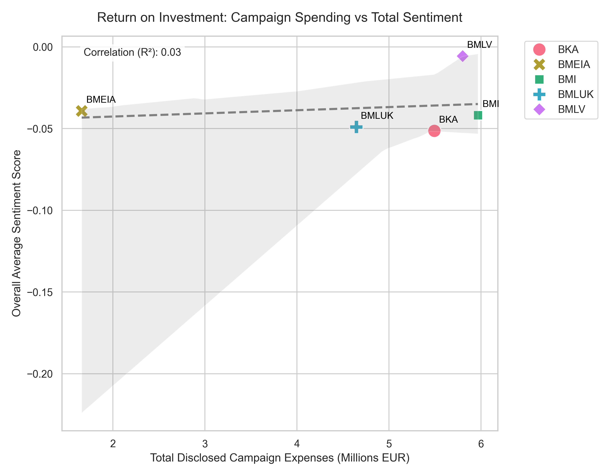
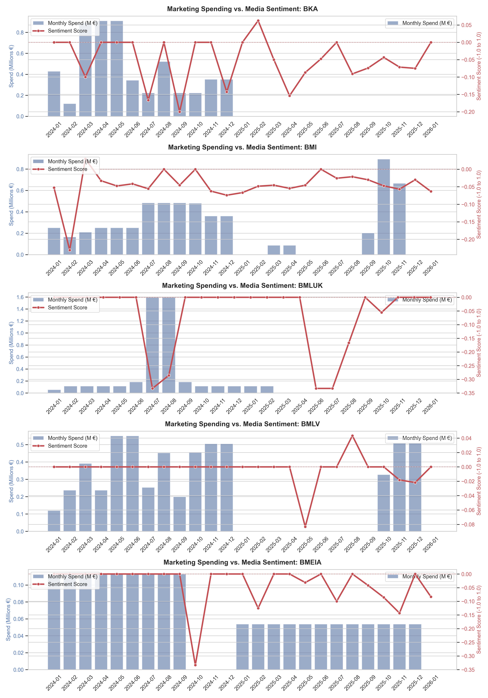

# Austrian Press Monitor

**Austrian Press Monitor** is a comprehensive, automated data pipeline and analytics engine designed to investigate the correlation between Austrian government media spending and the resulting public sentiment and "share of voice" in major national newspapers. 

By cross-referencing government financial disclosures (via manually harvested data from campaign reports) with targeted sentiment analysis of news articles, this project provides data-driven insights into the "Return on Investment" (ROI) of public media campaigns.

## 🎯 Key Features

- **Automated News Scraping**: Dynamically scrapes articles from 5 major Austrian newspapers (*Der Standard, Krone, Die Presse, Heute, Kleine Zeitung*) via Google News RSS and Playwright.
- **Financial Data Ingestion**: Parses media spending metrics from a manually curated CSV file that contains data gathered from campaign reports of 5 Austrian ministries from the years 2024 and 2025.
- **Context-Aware NLP Engine**: Utilizes SpaCy (Named Entity Recognition) and a Hugging Face Transformers model (`oliverguhr/german-sentiment-bert`) to evaluate the sentiment of the text. It uses isolated context windows around targeted Austrian ministries to prevent "sentiment dilution". 
- **Advanced Data Analysis**: Uses Pandas, Matplotlib, and Seaborn to aggregate relational data from an SQLite database, producing intricate visualizations that map financial spend against media sentiment across temporal boundaries.

## 🗂️ Codebase Architecture

The project is driven by a series of modular Python scripts located in the `scripts/` directory:

- `setup_db.py`: Initializes the SQLite database (`data/media_analysis.db`) with three relational tables: `financial_events`, `news_articles`, and `analysis_results`.
- `scraper.py`: Orchestrates the retrieval of news articles based on targeted keywords (Ministries), utilizing Google News RSS for discovery and Playwright for full-text extraction.
- `financial_scraper.py`: Fetches and standardizes government media spending data from the CSV dataset.
- `nlp_engine.py`: Processes the scraped articles to detect targeted organizations (e.g., BKA, BMI, BMLV). It explicitly slices a context window around mentions and feeds it into the German-BERT model for precise sentiment scoring. Hardware-accelerated for Apple Silicon (MPS).
- `analyzer.py`: Joins the NLP and financial datasets, aligns them temporally, and generates a suite of comparative visualizations in the `output/visualizations/` directory.

## 📊 Visualizations and Results

The `analyzer.py` script automatically synthesizes the database into several insightful charts:

- **Spending by Ministry** (`spending_by_ministry.png`): Total media campaign spending per ministry.
- **Share of Voice** (`share_of_voice_timeline.png`): Tracking the absolute mention volume of each ministry over time.
- **Sentiment Tracking** (`sentiment_timeline.png`): The rolling average net sentiment score per ministry over the observed period.
- **Return on Investment** (`spend_vs_sentiment.png`): A direct scatter plot mapping the total disclosed campaign expenses against the overall average sentiment score, complete with regression analytics.

  

- **Granular Temporal Breakdowns** (`granular_spend_vs_sentiment.png` & `granular_spend_vs_mentions.png`): Dual-axis subplot grids comparing monthly marketing spend directly against media sentiment and mention volume for each individual ministry.

  

- **Newspaper Bias Heatmaps** (`newspaper_cross_heatmaps.png`): Intersecting newspapers against ministries to highlight systemic sentiment biases and mention volumes.
- **The 3D FacetGrid** (`newspaper_5x5_facetgrid.png`): A comprehensive 5x5 structural plot overlaying campaign budgets and media sentiment per newspaper per ministry over time.

*(All generated graphs are exported to the `output/visualizations/` directory.)*

## 🚀 Installation

### Prerequisites
- Python 3.10+
- Hint: the NLP engine leverages MPS hardware acceleration for Apple Silicon (optional).

### Setup

1. **Install Dependencies:**
   ```bash
   pip install -r requirements.txt
   ```

2. **Download Required Models and Browsers:**
   ```bash
   python -m spacy download de_core_news_sm
   playwright install chromium
   ```

## 🛠️ Usage

The data pipeline is designed to be executed sequentially:

1. **Initialize the Database:**
   ```bash
   python scripts/setup_db.py
   ```

2. **Scrape News Articles:**
   *(Note: This uses Playwright and may take significant time depending on the date range).*
   ```bash
   python scripts/scraper.py
   ```

3. **Fetch Financial Data:**
   ```bash
   python scripts/financial_scraper.py
   ```

4. **Run the NLP Sentiment Engine:**
   ```bash
   python scripts/nlp_engine.py
   ```

5. **Generate Analysis & Visualizations:**
   ```bash
   python scripts/analyzer.py
   ```

## ⚖️ License

This project is licensed under the MIT/X11 license. Please refer to the `LICENSE` file for more information on usage rights and restrictions.